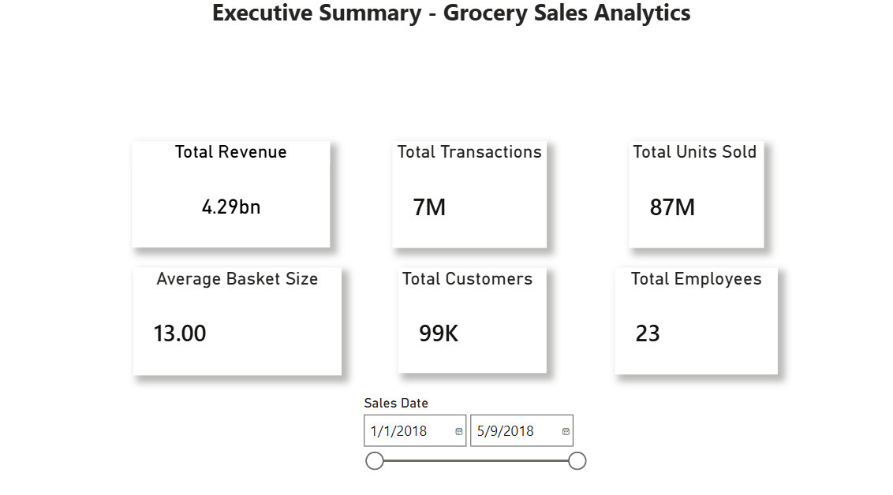
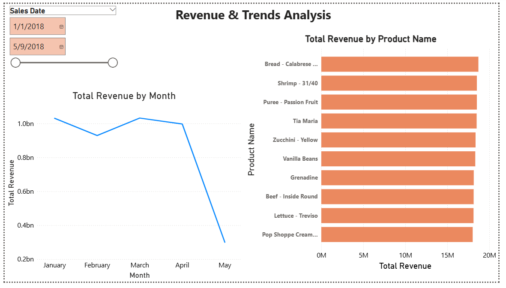
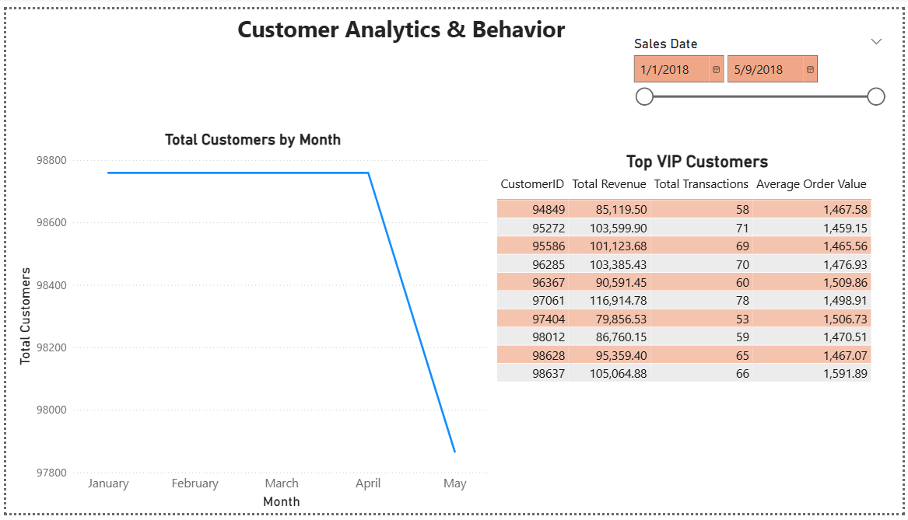
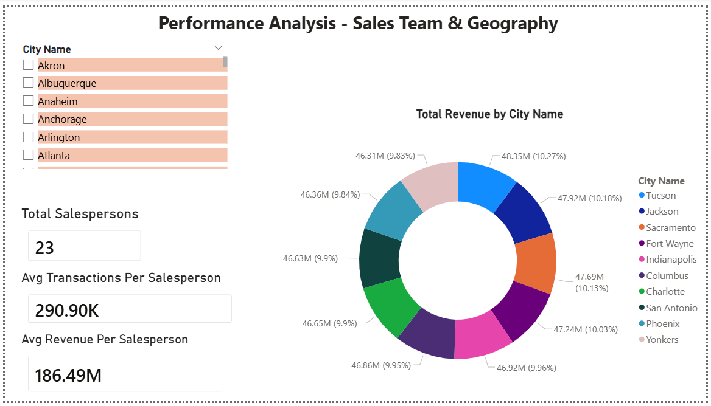
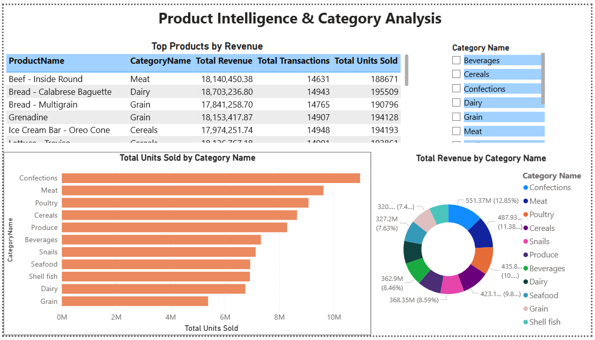

# Power BI Dashboard

This dashboard was created to visualize the SQL analysis from the Grocery Sales project in a simple and business-focused way.

It summarizes revenue, customer behavior, sales performance, and product/category insights using interactive Power BI pages.

The `.pbix` file is not included in this repository due to file size limitations. Dashboard screenshots and documentation are provided instead.

---

## 1. Executive Summary

### What this page shows
This page provides a high-level overview of the business using core KPI cards.

### Key metrics
- Total Revenue: **4.29bn**
- Total Transactions: **7M**
- Total Units Sold: **87M**
- Average Basket Size: **13.00**
- Total Customers: **99K**
- Total Employees: **23**

### Business interpretation
The business operates at a very large scale, generating strong revenue across millions of transactions.  
The average basket size of 13 units suggests that customers typically purchase multiple products per order, which is a positive sign for cross-selling and product bundling.

### Possible reasons
- Strong repeat purchasing behavior
- Broad product coverage across categories
- Stable customer base and high transaction volume

### Recommendation
The business should continue tracking these KPIs regularly and use them as a benchmark for future performance monitoring.

---

## 2. Revenue & Trends Analysis

### What this page shows
This page analyzes revenue trends over time and highlights the top-performing products by total revenue.

### Key findings
- Revenue remained strong from **January to April**
- **March** recorded the highest revenue
- **May** dropped sharply, likely because the dataset only covers part of the month
- Top products generated nearly **18M–19M** in revenue each

### Business interpretation
Revenue performance appears stable across the main months in the dataset, which indicates strong ongoing demand.  
The top products consistently contribute a significant portion of total revenue, showing that a small group of products plays an important role in overall sales performance.

### Possible reasons
- Seasonal demand or promotional activity may have supported March performance
- High-performing products likely combine strong demand with higher price points
- May appears lower because it is an incomplete month rather than a true business decline

### Recommendation
The business should monitor top products more closely, protect their inventory availability, and investigate whether their performance can be replicated across similar products.

---

## 3. Customer Analytics & Behavior

### What this page shows
This page focuses on customer volume over time and identifies top VIP customers based on revenue, transactions, and average order value.

### Key findings
- Customer count remained stable from **January to April**
- A drop appears in **May**, which is likely due to partial-month data
- Top VIP customers generated over **100K** in revenue
- Average order values for top customers are around **1.45K–1.59K**

### Business interpretation
The customer base appears stable, which supports consistent revenue generation.  
Top customers contribute a meaningful amount of revenue, showing that a high-value customer segment exists within the business.

### Possible reasons
- Repeat purchasing behavior is supporting customer stability
- High-value customers may purchase more frequently or buy larger baskets
- VIP customers are likely important drivers of long-term revenue

### Recommendation
The business should consider loyalty strategies, personalized offers, and retention programs for high-value customers to protect and grow this segment.

---

## 4. Performance Analysis – Sales Team & Geography

### What this page shows
This page evaluates sales team productivity and compares revenue across top-performing cities.

### Key metrics
- Total Salespersons: **23**
- Average Transactions per Salesperson: **290.90K**
- Average Revenue per Salesperson: **186.49M**

### Key findings
- Sales contribution appears evenly distributed across employees
- Top cities such as **Tucson, Jackson, and Sacramento** each contribute around **46M–48M**
- No single city overwhelmingly dominates performance

### Business interpretation
The sales team appears balanced, and geographic revenue is well distributed.  
This is a positive sign because the business is not overly dependent on a single employee or a single market.

### Possible reasons
- Standardized sales processes across the team
- Broad customer presence in multiple cities
- Balanced demand across geographic regions

### Recommendation
The business should continue monitoring both employee-level and city-level performance to identify future growth opportunities while maintaining operational balance.

---

## 5. Product Intelligence & Category Analysis

### What this page shows
This page analyzes product and category performance using top product tables and category-level unit/revenue charts.

### Key findings
- Top products generated around **18M** in revenue
- Categories such as **Confections, Meat, Poultry, and Cereals** lead in total units sold
- Revenue is distributed across several categories rather than concentrated in only one

### Business interpretation
The product portfolio is diversified, which reduces business risk.  
Strong-performing categories contribute both revenue and volume, suggesting a healthy product mix across the business.

### Possible reasons
- Popular categories likely benefit from frequent purchasing behavior
- High-performing products may combine demand, pricing strength, and repeat customer preference
- Category diversity supports overall revenue stability

### Recommendation
The business should continue investing in strong categories while reviewing lower-performing categories for pricing, positioning, or promotion improvements.

---

## Overall Dashboard Conclusion

The Power BI dashboard supports the earlier SQL analysis by presenting the results in a business-friendly and interactive format.

### Overall insights
- The business operates at large scale with strong revenue performance
- Revenue remained stable across the main observed months
- High-performing products and categories are key revenue drivers
- A valuable VIP customer segment exists
- Sales team contribution is balanced
- Revenue is geographically diversified

### Final recommendation
This dashboard can be used as a decision-support tool for:
- KPI monitoring
- Product performance review
- Customer retention strategy
- Sales team evaluation
- Geographic market comparison